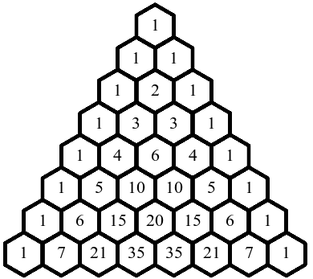

# Introduction

This lab is designed to introduce you to some of the programming
structures you’re probably used to from other languages, such as
strings, if statements, and loops. There are likely some other things
explained here that you might not have dealt with, such as bitwise
operations, recursion, switch statements, and low level arrays. By the
end of this lab, you will be expected to understand the following:

1.  Booleans (Bool type from C99).
2.  Bitwise operations.
3.  Arrays and how they work in C (without pointers).
4.  Strings and how they work in C.
5.  Conditional Statements (if, if-else, ternary, switch).
6.  Loops (while, do-while, for).
7.  Simple recursion.

The proceeding labs will build and expand this knowledge into the realm
of low level computing, including memory management, data structures,
methods for approaching low-level computation, and a variety of other
subjects. As such, knowing these key principles will be important for
future programming and development.


In this lab you are expected to perform the basics of cloning your Lab 3
repository from the GitLab course group. A link to the course group can
be found
[<span style="color: blue">here</span>](https://git.cs.dal.ca/courses/2022-fall/csci-1120)
and your repository can be found in the Lab3 subgroup. See the Lab
Technical Document for more information on using git. You will notice
that your repository has a file in the `Lab3` directory named
**delete_this_file**. Due to the limitations of GitLab, we are not
able to push completely empty directories. Before your push your work to
your repository (which should be in the `Lab3` directory anyway), make
sure to first use the <kbd>git rm</kbd> command to remove the extra file. If
you do not, your pipeline will fail.  

**Be sure to read this entire document before starting\!**

# Table of Contents
[[_TOC_]]


# Booleans

You may have noticed in your reading of data types in C that booleans
are rarely mentioned. In the early days of C, such as C89 (not surprisingly, 
from 1989), there was no concept of a boolean type in the C standard. 
Instead, programmers would use preprocessor directives and/or **typedef** 
statements to create their own boolean data types, often called bool. 
Normally bool types were just masks for char, short, or int types where 
0 was false and 1 was true.

As of C99, the **_Bool** type has been introduced, which holds a 0 or a
1 to represent a boolean value. It’s likely the name _Bool was chosen
to ensure the previous bool type definitions wouldn’t conflict with the
new type. For programmers with no potential for boolean type conflicts,
the `stdbool.h` library was created for the POSIX 2008 standard (which
has since been adopted into the ISO C Standard), which helps alleviate
some of the issues created by introducing the _Bool type. First, it
provides a clearer definition for true and false types, which has helped
prevent preprocessor directives having their text replaced by other
overzealous directives. Second, it provides a regular **#define**
directive so that **bool** can be used in place of **_Bool**.

If you want to use the built-in boolean type, be sure to import the
library and compile your code with at least the C99 standard. As
mentioned previously, all testing programs and scripts will be compiled
using the C18 standard to ensure as much compatibility as possible.

# Bitwise Operations

Bitwise operations are a feature of most languages which allow a
programmer to directly manipulate the binary representation of values
and pointers. Under normal circumstances, C’s minimum amount of
allocatable memory is one byte (or 8 bits, which is the bit length of a
char), meaning that we are not able to allocate individual bits.
However, by using bitwise operations we are able to manipulate the bits
of allocated integers with a series of low-level operations. Since these
operations must effect at least the minimum amount of allocatable
memory, you should always expect them to function on the entirety of the
value in question. That is, you can’t use a single bitwise operation to
only affect half of an integer or a single bit.

Before moving forward, we should have a short talk about **Arity**,
which describes the number of values a given operator takes. C has a
number of unary (1-ary; requires a single operand), and binary (2-ary;
requires two operands) operators, as well as a single ternary (3-ary)
operator. The most common unary operator in C is **!**, which accepts a
single value and negates it. Some common binary operators are add,
subtract, logical AND, logical OR, and the like. Bitwise operators
generally also winter into the binary operator category, typically
written in the form **A operator B**.

There are six bitwise operators in C: `AND (&)`, `OR (|)`, `XOR (^)`,
`NOT (~)`, `left shift (<<)`, and `right shift (>>)`. The non-shift operators and their outcomes can be found
in the following table:

| **A** | **B** | **A & B** | **A \| B** | **A ^ B** | **~A** |
| :---: | :---: | :-------: | :---------------: | :-------: | :-------------------------------------: |
|   0   |   0   |     0     |         0         |     0     |                    1                    |
|   0   |   1   |     0     |         1         |     1     |                    1                    |
|   1   |   0   |     0     |         1         |     1     |                    0                    |
|   1   |   1   |     1     |         1         |     0     |                    0                    |

Even though the above table only shows single bit values and the
effects, as mentioned before the bitwise operators will always affect an
entire integer value, so the given operator will be performed on every
corresponding bit pair across values A and B.

Some example outcomes of these operations can be seen here:

``` math

\begin{matrix}
    \begin{matrix}
   & 1010 \\
   \& & 1111  \\ \hline
   & 1010 
    \end{matrix}
&
    \begin{matrix}
   & 1010 \\
   \mathbf{\mid} & 1111  \\ \hline
   & 1111 
    \end{matrix}
&
    \begin{matrix}
   & 1010 \\
   \land & 1111  \\ \hline
   & 0101 
    \end{matrix}
&
    \begin{matrix}
   &  \\
   \thicksim & 1010  \\ \hline
   & 0101 
    \end{matrix}

\end{matrix}
```


The left and right shift operators are binary operators which move a
series of bits either to the left or to the right, adding additional 0’s
as padding on the tail end of the shifted bits. When a shift operator is
used as **A << B** or **A >> B**, the binary representation of A
is shifted B bits to the left or right respectively. For example, a left
shift of 4 could be performed on the number 13. In binary, the integer
13 is 1101, and shifting that 4 to the left would produce 11010000,
which is the integer number 208.


Be warned that if you attempt to right bit shift the value of a **signed
integer**, the system will attempt to maintain the current integer's
sign. This is important because it will carry the leading bit to the
right, potentially giving you numbers you didn’t expect. If you are
working with integers and need to bit shift to the right, it's generally
a better idea to first convert your integers to unsigned types
instead.


Something worth noting about the above operation is that because things
are being done with binary values, shifting something to the left by 1
will multiply the number by 2. Shifting something to the left by 4 is
the same as multiplying by 2 four times, which is $`2^4 = 16`$. It turns
out that $`13 \times 16 = 208`$ and $`13 << 4 = 208`$, for example.
Right shifting something has the opposite effect, meaning it will divide
by 2 for each bit shifted. This happens to be an incredibly quick way to
perform binary multiplications and divisions and is a type of operation
which is used as often as possible by your CPU. Compilers will optimize
as much as possible to perform bit shifts instead of multiplication or
division, as bit shifting is many times faster than arithmetic
operations.  

A simple code snippet for the above example can be seen here:

``` c
#include <stdio.h>

int main(int argc, char** argv)
{
    int a = 13;

    printf("%d\n", a);

    a = a << 4;

    printf("%d\n", a);

    return 0;
}
```

It’s worth mentioning that the bit shift operators are fairly low on
operator precedence. When using bit shifts with math, you should always
try to surround your bit shift operands with parentheses if you want
them to be calculated before a bit shift occurs. You otherwise may find
yourself getting strange numbers without any understanding of why.  
Some good uses of bitwise operations:

1.  Since AND is only true when both bits in the same position are 1, it
    is good for picking out exact bits that you’re interested in. Bit
    shifting a bit to the 1-bit position and then doing **A & 1** will
    extract that specific bit for you.  

2.  XORing something with itself will always quickly produce a value of
    0. The CPU does this regularly to reset its registers.


# Arrays

Arrays in C are a fairly rigid structure compared to some other higher
level languages, such as Python. Even Java has more accessibility
related to arrays than C. When it comes to C, array utility is
non-existent and using them often feels like you’re trying to hack away
at hardware technicalities. These are likely to be the most frustrating
part of the language for a good many people, especially when coupled
with pointers.

In this lab we will briefly talk about how to create and manage arrays,
but we won’t speak in-depth about pointers or memory allocation until
Lab 4. However, if you already understand how pointers work, feel free
to use them as it will make the process of dealing with arrays much
simpler.

Arrays are the most basic form of collection you can have in C. Under
the hood, arrays are just a block of memory that C knows a few things
about:  

1.  C knows how much space an array takes up in memory (in bytes).
2.  Under normal circumstances, C knows the data type that is being contained within an array.
3.  Because of the first two points, C does not "put elements in a container" so much as it jams the various data values end-to-end so that they fit perfectly in the memory block.

Because memory blocks are manually carved out in specific chunks, once
you have set the size of the array, you can’t make it bigger or smaller:
it will always hold exactly as much as was allocated in the first place.
Normally, when something resizes an array, it’s actually releasing
memory and then creating a new, bigger memory block for you to work
in.

**(Not So) Fun Fact**: even though C knows the above facts, it has no easily
accessible way of telling you exactly how big the array is. As such,
it’s important for you to keep track of the sizes of your various
arrays as much as possible, generally using variables or constants.
Thanks, C. *You jerk*.

Creating an array is very simple. Like other languages, arrays are
created using the **\[ \]** symbols.

``` c
#include <stdio.h>

int main(int argc, char** argv)
{
    // Creates an array for holding up to 10 integers.
    int a[10];
    
    // Creates a 4-element array and initializes its values.
    int b[] = {1, 2, 3, 4};

    // Changes the first element of b to 20.
    b[0] = 20;

    // Prints the first element of an array.
    printf("%d\n", b[0]);
    
    // Prints some element of something?
    printf("%d\n", b[15]);

    return 0;
}
```

The above code does work, and it does print two numbers. Sadly, because
there’s no understanding of boundaries in C, once memory has been
allocated to fit multiple data values (thus becoming an array), you can
go well beyond the limits of arrays and start looking through other
parts of your system’s memory. C won’t stop that from happening (on the
contrary, it will assume you know what you’re doing and let you try\!),
so it’s important to manually keep your program within the bounds of
your current arrays. However, if you try to *write* something outside of
the bounds of what you have been given by the operating system, you will
get a very vague message called a **segmentation fault**, which can be
very challenging to track down when you’re debugging because it’s simply
an error stating "you tried to write to memory you don’t own".

As seen above, you create an array using the \[ \] symbols and you can
access individual elements in the array using the \[X\] symbol notation,
where X is an index value. Indices in C begin at 0, so if you’re coming
from some other languages such as Lua you can run into trouble.

Changing the above code to switch the data type is perfectly reasonable,
as you can have an array of any type that is currently defined.

It’s also possible to make multi-dimensional arrays (which could be very
useful for one of the contracts in this lab). By appending more \[X\]
notations on the end of the array declaration will create an
N-dimensional array. For example, **int a\[10\]\[15\]** would create a
2d array, where there are 10 arrays stored, and each array has enough
space for 15 integers. When dealing with multi-dimensional arrays (and
arrays in general) which are being handed into functions, you should
look up how exactly to format your variable names and forward
declarations in order to make the function arguments work properly.

You can also access the values of multi-dimensional arrays using the
same notation as before, where you simply have more \[X\] symbols
appending to the array variable name. For example, would tell C that you
want to get the value from the 3rd index of the 5th array. To make it
easier on yourself, you can view the first dimension as the rows, and
the second dimension as the columns. Thus, the previous statement would
be getting the value from the 5th row, 3rd column, like a table of
values.

# Strings

Strings in C are a slight extension of arrays in the way that there
exists a string literal, which is defined by surrounding a set of
characters with double quotes (" "). You can also create strings by using
the standard array methods, but you have to make a few extra
considerations when creating them in this fashion.

``` c
char s[] = "this is a string";

char hi[20];

char hiAgain[] = {'H', 'e', 'l', 'l', 'o', '\0'};
```

The first two initializations of a string are fairly simple to
understand, but the third initialization is a little different. One of
the things that makes a string a string (and not just an array) is that
it terminates itself via the null character '**\\0**', which is
technically a 0 integer value. This is a special character which
represents the absence of any character value and is used by C to
dictate where the end of a string occurs, which is always before the end
of the memory block is reached.

This is an important feature of strings because it allows you to create
a string (char array) of size 100, but still functionally store shorter
strings inside that memory space. Functions such as printf (and the
entire string.h library) will only use the contents of a string up to
the first time it sees the null character. For example:

``` c
#include <stdio.h>

int main(int argc, char** argv)
{
    char s[] = "this is a string";

    printf("%s\n", s);

    s[6] = '\0';

    printf("%s\n", s);
 
    return 0;
}
```

Produces the output:
```plaintext
this is a string
this i
```

Notice that after adding the null character in the middle of the string,
the output is now being shorted in printf statements. This will apply to
most functions in the C programming language, including those in the
string library. The string library offers useful functionality for
dealing with strings, such as a comparison function, a tokenizing
function, a function for copying strings, and a function for finding the
length of a string. It will be worth your time to become acquainted with
the string library as soon as possible.

# Control Flow

Control flow (or flow of control) is your ability to manage the order of
statement execution at run time. It allows for necessary features such
as the ability to branch code in multiple directions based on the
current state (such as if statements) and the ability to repeat sections
of code to help with modularity and code compactness (such as with
loops).

## Conditionals and Cases

### If Statement

If statements in C are largely similar to other programming languages,
especially C derivatives such as Java. It consists of an if keyword, a
condition in parentheses, and then a code block which is executed when
the provided condition is true.

``` c
if(some_condition)
{
    // Run this code if the condition is true.
}

// Whether the condition is true or false, we will execute the rest of the code here.
```

Conditions are handled very similarly to other languages, where you can
use some combination of comparison (relational) operators and logical
operators to create compound conditions. For example:

``` c
// This if statement's code block will execute if the value variable is greater than 3.
if(value > 3)

// If the value variable is greater than three or the other variable is less than or equal to 2.
if(value > 3 || other <= 2)

// If the value variable is not null and the value variable is not 15.
if(value != NULL && value != 15)
```

The comparison operators are all binary in arity, meaning they need two
values (A and B in this example) to execute properly. When using these
operators, be aware that they always compare the **primitive value** or
**memory address** of A and B, not (for instance) the contents of an
array or string, **so be sure to use an appropriate array or string
function to compare those values instead**. A list of comparison
operators can be found here:

| **Operator** | **Usage**  | **Outcome**                                      |
| :----------: | :--------: | :----------------------------------------------- |
|     \==      |   A == B   | Returns true if A is equal to B.                 |
|     \!=      |  A \!= B   | Returns true if A is not equal to B.             |
|    >   | A > B  | Returns true if A is explicitly greater than B.  |
|    >=    | A >= B | Returns true if A is greater than or equal to B. |
|    <    | A < B  | Returns true if A is explicitly less than B.     |
|    <=    | A <= B | Returns true if A is less than or equal to B.    |

The logical operators are also binary in arity, so they also need two
values. Logical operators allow you to combine the comparison operators
into a single condition called a compound conditional statement. A list
of logical operators can be found here:

| **Operator** |  **Usage**   | **Outcome**                                                                    |
| :----------: | :----------: | :----------------------------------------------------------------------------- |
|      &&      |   C1 && C2   | If both C1 and C2 are true, then the whole compound statement is true.         |
|  $`\mid\mid`$    | C1 $`\mid\mid`$ C2 | If either C1 is true or C2 is true, then the whole compound statement is true. |
|      !      |     !C1     | If C1 is false, then \!C1 is true, making the whole compound statement true.   |

As with other programming languages, the logical operators in the table
above have the ability to short circuit. This means that the program
will proceed through the conditions from left to right (which are
separated by logical operators) and as soon as one of the conditions
breaks the logic of the operators in question, the search for the
condition will stop.

For example, if you have **A**  $`\mid\mid`$ **B**  $`\mid\mid`$ **C**  $`\mid\mid`$ **D** as a compound
condition, only one of those has to be true in order for the entire
statement to be true. If A evaluates to false, then it will move on to
B. If B evaluates as true, then your program will not evaluate C or D
because the condition for a logical OR has been met. This means the
order in which you check conditions can be very important, so construct
your compound conditions wisely. This can save your program processing
time later.

Note that this logic also applies to logical AND compound statements,
where the first condition evaluating to false makes the entire compound
condition false, and thus processing will stop.

### If-Else Statement

The if-else statement is an expansion of the if statement which allows
you to add additional detail to your conditional statements. They act
similar to other languages, where if the condition fails (is false),
then the **else** block of the if-else statement is executed.

``` c
if(some_condition)
{
    // Run this code if the condition is true.
}
else
{
    // Run this code if the condition is false.
}

// Whether the condition is true or false, we will execute the rest of the code here.
```

You can also combine this with another if or if-else statement to nest
your conditional statements in a way that creates a chain of else-ifs:

``` c
if(some_condition)
{
    // Run this code if the condition is true.
}
else if(some_other_condition)
{
    // Run this code if the other condition is true.
}
else
{
    // Run this code if all of the conditions fail.
}

// Whether the condition is true or false, we will execute the rest of the code here.
```

### Ternary Conditional Operator

The ternary operator is a computationally efficient means of performing
conditional in-line assignment during code execution. It’s faster than a
regular if statement, although slightly more limited. Its most common
use is for selection variable assignments and returns where a regular
if-statement would be overkill.

The ternary operator is broken down into a very simple structure with a
few new keywords. It is the only operator in C which requires three
values (thus ternary), and it can be written as follows:

``` math
 ( \textit{ some\_condition } \textbf{ ? } \textit{ this\_if\_true } \textbf{:} \textit{ this\_if\_false } );
```

The ternary operator starts with a condition, followed by a question
mark (?), followed by a C statement which is executed if the condition
is true, followed by a colon (:), followed by a C statement which is
executed if the condition is false. This can be placed as a line of its
own, or in-line as follows:

``` c
// Create a variable and store 10 inside.
int value = 10;

// Create a variable and store 9 inside.
int largest = 9;

// If the value is greater than largest, then largest = value.
// If the value is not greater than largest, then largest = largest.
largest = ( value > largest ? value : largest );
```

The ternary operator is useful when filtering things such as values for
variables, or values of return statements, and are much more compact
than regular if statements. They also have the benefit of returning the
value to the code in-line, which means they’re capable of picking
between return values and, as such, end up more deterministic than
regular if statements from both the code flow and CPU execution point of
view.

### Switch Statement

Switch statements (also known as switch-case or case-switch statements)
are a special kind of conditional statement in the way that they don’t
technically use a condition at all. From the CPU point of view, this is
great news (ask why during lectures\!), although switch statements only
work under specific conditions.

Switch statements take advantage of an algorithm called a **hashing
algorithm**. Effectively, the switch designates certain parts of memory
to hold the code that you give it, and that memory location is chosen
based on the conversion of a series of code block titles called
**cases**. You define an expression at the beginning of the switch,
which is normally a variable or value. The switch statement then
converts that into a number which corresponds to a memory block and the
code instantly jumps to that memory block. As such, there isn’t any
waiting for a condition to be met, so switches operate much quicker than
if-statements. That said, not every data type is valid for being an
expression, so you will have to do some research to figure out which
ones will work for your particular design.  

``` c
int value = 10;

switch(value)
{
    case 3:
        printf("Value is 3\n");
        break;
    case 5:
        printf("Value is 5\n");
        break;
    case 10:
        printf("Value is 10\n");
        break;
    default:
        printf("I didn't expect this value.\n");
}
```

Notice the **break** statements? Switches create memory blocks which are
considered contiguous (one after the other). If you don’t include a
break at the end of each case, you will get **winter-through
behaviour**, where it will drop to the next case’s code and continue
executing. Be careful about how you set up your switch statements. You
don’t want them executing everything when they shouldn’t be.

Also notice the **default** case. This case’s code is executed when the
expression held by the switch statement does not resolve to one of the
cases. In the above example, if **value** does not equal 3, 5, or 10,
the switch statement will run the default case instead.

## Loops

A loop, very simply, allows a programmer to execute a block of code
multiple times. In C, the standard means of looping are via while loops,
do-while loops, and for loops. C also has the ability to perform
recursion, meaning a function is able to call itself to simulate looping
behaviour.

### While Loops

While loops repeatedly execute their associated code body as long as
their condition is true. It’s possible for while loops to have no code
body, in which case they must be terminated as any regular statement,
with a semicolon. If their condition ever becomes false, then they stop
executing and your program continues regular execution after the while
loop declaration.

``` c
while(some_condition)
{
    // While the condition is true, this code runs.
}

// When the condition fails, we execute from here.
```

``` c
// You'd better hope this ends someday. This will execute with no code body.
while(some_condition);

// When the condition fails, we execute from here.
```

### Do-While Loops

Unlike a while loop, the code contained within a do-while loop will
**always** be executed at least once. After the code is executed, it
will check the condition and if the condition is true, the code
contained within the loop will be executed again. If it is false, the
loop will stop executing and the program will continue after the
do-while declaration.

``` c
do
{
    // Run this code at least once. If the condition is true, we'll run it again.
} while(some_condition)

// When the condition fails, we execute from here.
```

### For Loops

For loops give the programmer more control over exactly how many times
the loop will be executed. A for loop has three expressions, separated
by semicolons (;) and surrounded by parentheses: the **initialization**
expression, the **conditional** expression, and the **iteration**
expression. A for loop can be seen here:

``` c
for(initialization; condition; iteration)
{
    // Run this code as long as the condition is true.
}

// When the condition fails, we execute from here.
```

For loops in C are effectively a shorthand version of a while loop.
Consider the following two loops and notice their similarities:

``` c
int i = 0;

while(i < 10)
{
    printf("%d\n", i);
    i++;
}

for(int i=0; i < 10; i++)
{
    printf("%d\n", i);
}

// When the condition fails, we execute from here.
```

The initialization expression allows you to initialize any variables
you’d like. It is executed once at the beginning of the for loop. The
conditional expression sets the condition by which the for loop should
end. It executes once per loop iteration. The iteration expression
allows you to set the rules for how your variables should change after
every loop. It executes once per loop iteration **before** the condition
is tested.

### Recursion

Recursion is the act of a function calling itself, and most recursive
function implementations (though not all) act in such a way as to reduce
the problem space with each call, often by using subsets of arrays or
slowly changing variable values. When using recursion, there must be an
exit condition, which is a conditional statement that tells the function
when to stop calling itself.

``` c
type functionName(parameters)
{
    if(some_stop_condition)
    {
        // If we meet the criteria for stopping, we should
        // return this function instead of calling it again.
        return something;
    }
    
    // Our stop condition wasn't met. We need to make another function call.
    return functionName(parameters);
}
```

Recursion can be an incredibly powerful tool for computational
efficiency and creating compact code. For example, if you wanted to
print every number from 9 to 0:

``` c
#include <stdio.h>

void printDecrement(int i)
{
    if(i == -1)
        return;
    
    printf("%d ", i);
    printDecrement(--i);
}

int main(int argc, char** argv)
{
    printDecrement(10);
}
```

Or, we can count up from 0 to 9:

``` c
#include <stdio.h>

int printIncrement(int i)
{
    if (i == 0)
        return i;

    printf("%d\n", printIncrement(i - 1));
    return i;
}

int main(int argc, char** argv)
{
    printIncrement(10);
}
```

# Lab 3 Function Contracts

In this lab you will be responsible for fulfilling two lab contracts:
the **libraries** contract and the **pascal** contract. Each contract 
is designed to test you on some of the things you’ve learned throughout 
the instruction portion of this lab. 

All contracts must be completed exactly as the requirements are laid
out. Be very careful to thoroughly read the contract instructions before
proceeding.

This does not, however, preclude you from writing **more** functions
than you are asked for. You may write as many additional functions as
you wish in your C source file, except in the **libraries** contract,
which has very specific requirements.

All contracts are designed to be submitted without a main function, but
that does not mean you cannot write a main function in order to test
your code yourself while you’re writing your programs. It may be more
convenient for you to write a C source file with a main function by
itself and take advantage of the compiler’s ability to link files
together by accepting multiple source files as inputs. When you push
your code to Gitlab, you don’t need to <kbd>git add</kbd> any of your extra
main function source files.

The programs you write for this lab will be compiled using your
`Lab3/lib` folder as a source for headers, meaning any functions
contained within `mmath.h` and `mstring.h` will be explicitly
compiled. The compiler will also be run with the <kbd>-lm</kbd> flag, in case
you need to import the math library.

For those of you who are concerned, when deciding which naming
conventions you want to use in your code, favour consistency in style,
not dedication to a style that doesn’t work.

## Libraries

### Problem

There are some math and string functions which C does not provide
through built-in libraries. Your task is to write two libraries, which
include two header files, designed for use with contracts in
this course.

The first new library you will create is the More Math library (`mmath.h`), 
which will contain a selection of new math functions will you may find 
useful in this course, including the ability to check if numbers are prime 
or finding the factorial of a number. Descriptions of each function and 
what they should do can be found here:

  - **Factorial**
    The factorial function **fact** is designed to calculate the
    factorial of a given integer $`n`$, such that
    $`n! = k = n · (n-1) · (n-1) · .. · 2 · 1`$. A
    factorial is always given as an exclamation point (!) after a value
    $`n`$ and may be calculated by starting at $`n`$ and multiplying it
    by every integer less than $`n`$, but greater than 0. The factorial
    0! is always equal to 1. You will not be given negative numbers as
    input. Your function will accept a single **int** value and return a
    **long** value representing $`k`$ in $`n! = k`$.  

    Examples:  

    $`0! = 1`$

    $`1! = 1`$

    $`2! = 2 · 1 = 2`$

    $`3! = 3 · 2 · 1 = 6`$

    $`4! = 4 · 3 · 2 · 1 = 24`$

  - **N choose K**  
    N choose K, usually written $`n \choose k`$, is a math formula for
    determining how many unique ways you can select $`k`$ items from a
    pool of $`n`$, where $`n`$ and $`k`$ are both integers. If you have
    3 items and want to know how many different combinations of 2 items
    there are from that pool, $`{3 \choose k} = 3`$. You can imagine
    this very easily because if you have three items, $`ABC`$ and you
    want all of the unique groups of two items, you can intuitively see
    that those unique groups would have to be $`AB, AC, BC`$ (because N
    choose K assumes you can’t pick the same item twice).

    You should also note that $`{n \choose n} = 1`$ because there’s only
    one way to select $`n`$ items from a pool of $`n`$ items (one
    selection of all of them at once), $`{n \choose 1} = n`$, because
    there are exactly $`n`$ ways to choose 1 item from a pool of
    $`n`$ (each selection gets one of the items), and
    $`{n \choose 0} = 1`$, as there’s only one way to choose nothing
    (one selection with no items in it).

    The formula used to represent this uses factorials (which you’re
    writing a function for, so make sure you use it\!) and can be seen
    here:

    ```math
    {n \choose k} = \frac{n!}{k!(n-k)!}
    ```
    
    When writing your own function, **nchoosek**, it’s recommended that
    you calculate the numerator and denominator separately and then
    return the result of the division. Your function will accept two
    **int** values, one for $`n`$ and one for $`k`$, and return a
    **long** value representing the result of the formula.  

    Examples:  

    $`{1 \choose 1} = 1`$

    $`{3 \choose 2} = 3`$  
    
    $`{4 \choose 2} = 6`$  
    
    $`{5 \choose 3} = 10`$  
    
    $`{6 \choose 2} = 15`$
    
  - **Prime**  
    For our purposes, a prime number is an integer greater than 1 which
    is only evenly divisible by itself and 1. As a starting point, the
    number 2 is considered prime. All numbers after that must then meet
    the rules of divisibility, however a number $`n`$ can only be evenly
    divisible by numbers in $`[1, n]`$, so no need to check if 16 is
    divisible by 21. Some simple things to consider when determining if
    a number is prime:
    
    1.  Consider checking all of the simple cases first, such as if the
        input is less than 2, if it’s equal to 2, if it’s divisible by
        2.
    
    2.  When writing a loop to check if your number $`n`$ is prime,
        remember to only check odd numbers after 2, and you only have to
        check the values up to $`\frac{n}{2}`$ because anything greater
        than that will not be an integer division. That is, in integer
        math, if $`n = 17`$, $`\frac{17}{2} = 8`$, and the only way to
        divide 17 and get a number greater than 8 is if you
        divide by a fraction. For example, $`\frac{17}{1.5} = 11.333`$,
        and thus you’re not dealing with divisions by integers anymore.
          
    When writing your **prime** function, you will accept a **long**
    value and return a **bool**. Return true if the **long** value is
    prime, otherwise return false.  

    Examples:  

    2 is prime (default)  
    3 is prime (factors: 1, 3)  
    4 is not prime (factors: 1, 2, 4)  
    5 is prime (factors: 1, 5)  
    6 is not prime (factors: 1, 2, 3, 6)  
    7 is prime (factors: 1, 7)

The second new library will be the More Strings (`mstring.h`) library,
which will contain a string reversal function. The string reversal
function, **strrev**, accepts a **char** array as a **char\***. **For
all intents and purposes, you can treat this **char\*** type as a char
array, AKA a string**. The only thing you can’t do to it is use the
**sizeof** statement to determine its size. If you want to know the size
of a string, I recommend checking Timberlea’s manual page for the strlen
function by entering <kbd>man strlen</kbd> into your terminal. You can exit a
manual page by pressing <kbd>q</kbd> on your keyboard.

The string reversal function expects you to accept the string as an
input and then reverse it in-place. This means you may not make a new
string and try to pass it out of the function. You must perform the
reversal operation exactly on the string you receive. This will require
a for loop, some math, and clever use of array indexing. I don’t think I
need to give you an example of reversing a string, because it’s just a
word with the characters in reverse order.

### Preconditions

Your `mmath.h` header file will contain forward definitions and any
necessary library imports to ensure the proper operation of your
functions. You must also write an accompanying `mmath.c` file
containing all of the matching function implementations. When you
compile, you will need to include the source file in your command in
order to ensure the functions exist during the linking process. **You
may not include any additional helper functions in these library files,
as that they could break the structure of the library!**

Your **mmath** library must include the following functions:

| **Requirement**  | **Conditions**                                                                                   |
| :--------------- | :----------------------------------------------------------------------------------------------- |
| Function         | long fact(int)                                                                                   |
| Input Parameters | An integer representing $`n`$ in $`n!`$.                                                         |
| Return Value     | A long integer value representing $`k`$ in $`n! = k`$.                                           |
| Notes            | The input in testing will never be negative. Never use recursion to calculate factorials! |

| **Requirement**  | **Conditions**                                                                                   |
| :--------------- | :----------------------------------------------------------------------------------------------- |
| Function         | long nchoosek(int, int)                                                                          |
| Input Parameters | An integer $`n`$ and an integer $`k`$ representing $`\dbinom{n}{k}`$.                            |
| Return Value     | A long integer value representing the result of $`\dbinom{n}{k}`$.                               |
| Notes            | The input in testing will never be negative.                                                     |

| **Requirement**  | **Conditions**                                                                                   |
| :--------------- | :----------------------------------------------------------------------------------------------- |
| Function         | bool prime(long)                                                                                  |
| Input Parameters | A long integer value.                                                                            |
| Return Value     | An integer boolean value, where false (0) says the input is not prime and true (1) says it is prime.            |
| Notes            | The input in testing will never be negative.                                               |

Your **mstring** library must include the following functions:

| **Requirement**  | **Conditions**                                                                                   |
| :--------------- | :----------------------------------------------------------------------------------------------- |
| Function         | void strrev(char\*)                                                                              |
| Input Parameters | A character string of any length.                                                                |
| Return Value     | Your function should not return anything.                                                        |
| Notes            | You must reverse the string in-place. No copies or returns are necessary. Note that this function accepts a char\*. As far as you are concerned, a char\* is the same as a char array. You can treat it the same as long as you use string.h functions to determine things such as length.|

### Postconditions

The library files need to exist, the functions need to return the
correct values for their purpose, and everything must compile.

### Restrictions

No structs, no manual memory allocation. We haven’t learned pointers
yet, but feel free to use them.

### File Requirements

This contract requires you to provide C source files named `mmath.c`
and `mstring.c` and C header files named `mmath.h` and
`mstring.h` Your header files should contain your forward
declarations. Your source files must not contain any main functions, or
it will fail during testing.

Your source and header files should be placed in the `Lab3/lib/`
directory in your GitLab repository.

### Testing

To test your code, you can compile your source files with the
`mathM.o` or `stringM.o` object files found in `CI/objects/lib`
It can then be executed as normal. The object files contain main
functions, so you do not need to provide your own.

### Sample Inputs and Outputs

Sample inputs and outputs are available via the object files. When
executed, they will output success and error messages, along with the
parameters used to test them.


## Pascal

### Problem

Given a integer, print that row of Pascal’s Triangle.



### Preconditions

You must provide a single function which meets the requirements in the
table below. You may include other functions as long as the requested
function executes correctly. Do not include a main function in your
source or header files.

Pascal’s Triangle is an array of numbers which are structured as a
downward-growing triangle which is often used to show a recurrence
relation between a number of choices and how many ways we can select
subsets of those choices, typically referred to as **combinations**,
which are a focus of the field of combinatorics.

The triangle has many interesting properties, such as each row summing
to a power of 2, justified diagonals of the triangle summing to the
Fibonacci sequence, and each row’s digits concatenating to powers of 11.
The feature of the triangle we will focus on here is the triangle’s
ability to tell us how many different ways we can select K items from a
pool of N items.

We usually write this question in the form of **N choose K**, which is
written as $`{N\choose K}`$ in mathematics. A single row $`N`$ in
Pascal’s Triangle contains $`N+1`$ terms, where each term is counted
using $`K`$ from left to right. $`K`$, therefore, has a range of
$`[0, N]`$. By moving along a row with Pascal’s Triangle, each term
tells us how many items we can choose from a pool with increasing
numbers of selections.

For example, the fourth row (starting from row 0) of Pascal's Triangle contains the terms $`{1, 4, 6, 4, 1}`$. This means that if we have $`4`$ items to choose from, but we can only choose $`3`$ (which is $`{4\choose 3}`$), we can look at the 4th term in the list and see that there are 4 ways to select from those items, assuming we don't care what order they're chosen in. It's also worth noting that the first $`K`$ term is 0, and there's only one way to choose no items from the pool. On the other hand, the last $`K`$ term is $`N`$, and there's only one way to choose all of the items from any item pool.

It turns out that the equation for determining a $`Kth`$ term in an $`Nth`$ row is recurrent, which means it looks at a previous row to determine its value. Any value in the triangle is the sum of the two values directly above it to the left and right. This is usually written as:

``` math
{N\choose K} = {{N-1}\choose {K-1}} + {{N-1}\choose {K}} = \frac{N!}{K!(N-K)!}
```

| **Requirement**  | **Conditions**                                      |
| :--------------- | :-------------------------------------------------- |
| Function         | void pascal(int)                                    |
| Input Parameters | A integer value for row $`N`$ in Pascal’s Triangle. |
| Return Value     | Your function should not return a value.            |
| Files Required   | `pascal.c`, `pascal.h`                              |

### Postconditions

Your function must output to the standard output stream. The output must 
print each term in the Nth row of Pascal's Triangle, each followed by a 
single space, with each line terminated by a newline character.

### Restrictions

You may not use any structs or manual memory allocation. We have not
learned pointers yet, but you may feel free to use them.

### File Requirements

This contract requires you to provide a C source file named `pascal.c`
and a C header file named `pascal.h`. Your header file should contain
your forward declarations. Your source file must not contain a main
function, or it will fail during testing.

Your source and header files should be placed in the `Lab3/pascal/`
directory in your GitLab repository.

### Testing

To test your code, you can compile your source file with the
`pascalM.o` object file found in `CI/objects/pascal/`. It can then
be executed as normal. Make sure you compare your output to the 
expected output to ensure your whitespace formatting is correct.

### Sample Inputs and Outputs

| **Input** | **Output**       |
| :-------- | :--------------- |
| pascal(4) | 1 4 6 4 1        |
| pascal(6) | 1 6 15 20 15 6 1 |
| pascal(0) | 1                |

# Submission

## Required Files

When submitting this lab, you must submit your C source and header files
only. Each file must be contained in the directory listed in the
structure requirement diagram below. These files include:

1. `mmath.c`
2. `mstring.c`
3. `mmath.h`
4. `mstring.h`
5. `pascal.c`
6. `pascal.h`

As with all labs, submitting anything other than what is required in
this section will cause the testing scripts to fail.

## Submission Procedure and Expectations

Your code will be submitted to your Lab 3 GitLab repository using the
same method as outlined in the Lab Technical Document. Refer to that
document if you do not remember how to submit files via the GitLab
service. A link to your repository can be found in the `Lab3` subgroup
of the CSCI 1120 GitLab group
[<span style="color: blue">here</span>](https://git.cs.dal.ca/courses/2022-fall/csci-1120).  

As mentioned in the Lab Technical Document, we will provide you with a
CI/CD script file which will help you test your submissions. The .yml
file containing the CI/CD test script logic, and any other necessary
script files, are available in your repository at all times. You are
free to view any of the script files to help you understand how our
testing scripts will function. We make extensive use of relative path
structures for testing purposes, which is why strict adherence to
directory structure and file contents is such a necessity. Also remember
to check your pipeline job outputs on the GitLab web interface for your
repository to see where your jobs might be failing.

Remember to follow the instruction guidelines as exactly as possible.
Sometimes the pipeline scripts will not test every detail of your
submission. **Do not rely on us to perfectly test your code before
submission.** The CI/CD pipeline is a great tool for helping you debug
major parts of your submissions, but you are still expected to follow
all rules as they have been laid out.

## Submission Structure

In order for a submission to be considered valid, and thus gradable,
your git repository must contain directories and files in the following
structure:

```plaintext
Lab3/
 ┣ lib/
 ┃  ┣ mmath.c
 ┃  ┣ mmath.c
 ┃  ┣ mstring.c
 ┃  ┗ mstring.h
 ┗ pascal/
    ┣ pascal.c
    ┗ pascal.h
```

As with all labs, accuracy is incredibly important. When submitting any
code for labs in this class, you *must* adhere to the directory
structure and naming requirements in the above diagram. Failure to do so
will cause the testing scripts to fail.

Remember to remove `Lab3/delete_this_file` from your repository
using <kbd>git rm</kbd> to avoid any pipeline failures.
